# 📔 DateNote

> Flutter · Firebase · OpenAI · GetX 기반 AI 데이트 플래너 & 기록 앱
> 

---

## ✨ 주요 기능

| # | 기능 | 설명 |
| --- | --- | --- |
| 1 | 데이트 플랜 추천 | 위치·날씨·취향(나이·데이트 스타일 등)을 GPT 프롬프트로 전송해 응답을 받아
데이트 플랜 추천, 데이트 플랜에 장소 직접 추가 |
| 2 | 데이트 기록 | 기분, 태그, 사진/영상, 관련 데이트 플랜을 추가하여 그날의 데이트 기록  |
| 3 | **주소 관리** | 자주 가는 장소를 현재 위치, 또는 다음 주소 API 를 이용하여 추가 |
| 4 | 커뮤니티 | 데이트 기록을 공유하며 좋아요, 댓글로 소통 |
| 5 | 캘린더 | 내 데이트 기록, 데이트 플랜 캘린더 형식으로 모아보기 |

---

## 🏗️ 기술 스택

- **Flutter 3.32.0 / Dart 3.8.0**
- **GetX** : 상태·라우트·DI·페이징
- **Firebase** : Auth(구글), Cloud Firestore, Cloud Functions, Storage
- **외부 API** : Chat/Responses API (JSON response format), openweathermap api, kakao local api
- **Model** : freezed, build_runner, json_serializable
- **Other Packages** : table_calendar, geolocator, get_storage, reorderables, video_player 외 상세 목록은 [`pubspec.yaml`](https://chatgpt.com/c/pubspec.yaml) 참고

---

## 🗂️ 폴더 구조

```
lib/
 ├─ constant/       # config, converter, enum, theme 등
 ├─ modules/        # 데이트 플랜, 기록, 커뮤니티 등 각 화면별 view 와 controller
 ├─ routes/         # GetPage, RouteName 관리
 ├─ services/       # 공통 외부 API(weather, kakao local, openai api 등)
 ├─ util/           # api, 공통 함수, 공통 위젯, mixin, file 관련 함수 등
 └─ main.dart       # Firebase 초기화 & GetMaterialApp
assets/             # 이미지 · 번들 리소스

```

---

## 🛠️ 구현 핵심 포인트

| 카테고리 | 구현 요약 |
| --- | --- |
| **동시성 제어 (업로드 Progress)** | `synchronized` 패키지의 `Lock.synchronized` 블록으로 다중 파일 업로드 진행률 race condition 방지 |
| **Firebase 트랜잭션 관리** | Firestore `runTransaction` 안에서 `arrayUnion / arrayRemove`로 좋아요 토글, 원자적 데이터 업데이트 |
| **이미지·영상 압축 & 상태 모달** | `image_compress` / `video_compress` 로 용량 축소 → Storage 업로드, 진행률 다이얼로그 & 썸네일 미리보기 |
| **최소 UI 리빌드** | `GetBuilder(id)` + `controller.update(['id'])` 와 `Obx` 로 필요한 위젯만 갱신해 렌더 비용 최소화 |
| 병렬 실행으로 처리 속도 향상 | `assetList.map((assetModel) async {`, `Future.*wait` 을 사용하여 api 요청, 이미지 업로드 등 병렬로 실행하여 처리 속도 개선* |

---

## 🔧 로컬 실행 방법

1. **환경 준비**
    
    ```bash
    # Flutter 3.x (stable)
    flutter --version
    
    ```
    
2. **레포 클론 & 의존성 설치**
    
    ```bash
    git clone https://github.com/ora16382/datenote.git
    cd datenote
    flutter pub get
    
    ```
    
3. **Firebase 설정**
    - Firebase 콘솔에서 iOS/Android 앱 등록 후 `google-services.json`, `GoogleService-Info.plist`를 각 플랫폼 폴더에 복사
    
4. 환경 변수 설정(.env 예시)
    
    ```
    OPENAI_API_KEY=your_openapi_key
    KAKAO_API_KEY=your_kakao_api_key
    WEATHER_API_KEY=your_weather_api_key
    ```
    
5. **Cloud Functions (선택)**
    
    ```bash
    cd functions
    npm install
    npm run serve   # 로컬 에뮬레이터
    
    ```
    
6. **런 & 빌드**
    
    ```bash
    flutter run   # 디바이스 선택
    flutter build apk --release
    
    ```
    

---

## 📸 스크린샷

### 1. 로그인, 프로필 설정

<p align="center">
  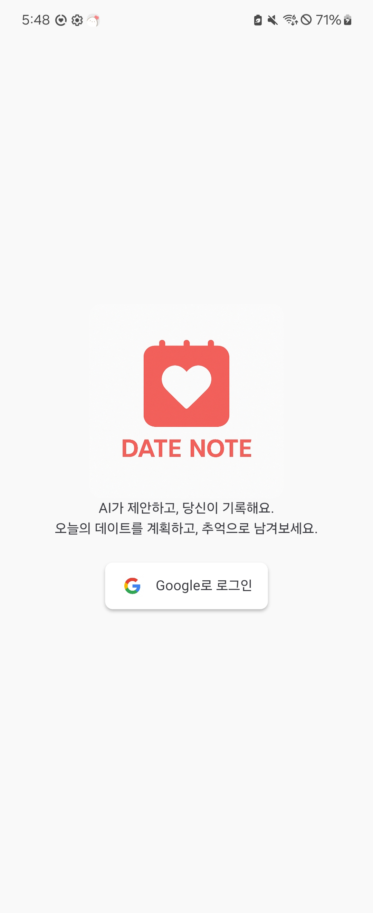
  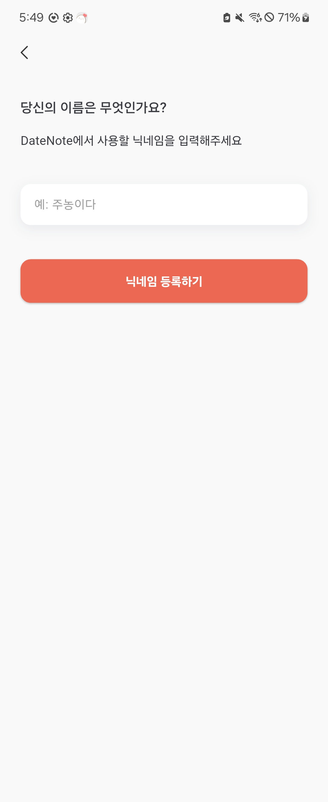
  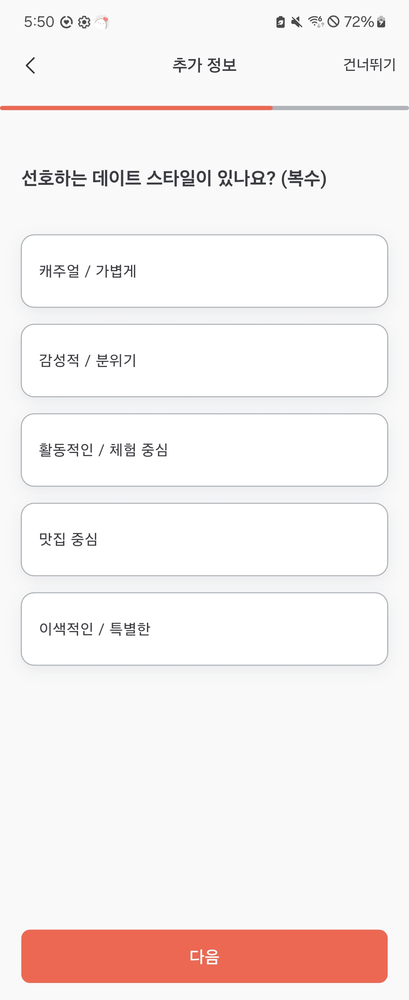
  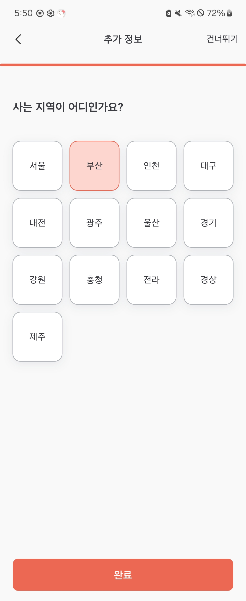
</p>

---

### 2. 주소 관리

<p align="center">
  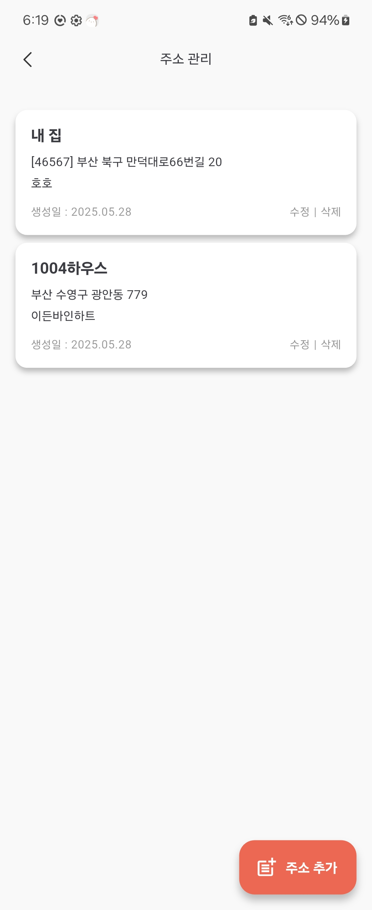
  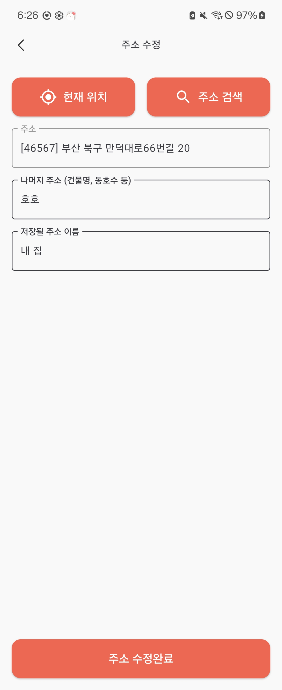
  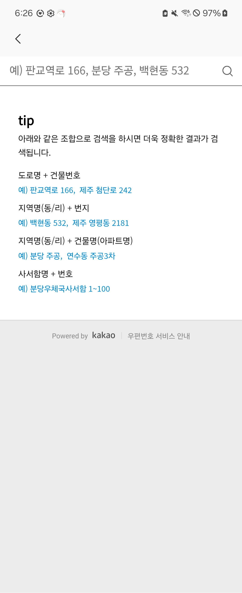
</p>

---

### 3. 데이트 플랜

<p align="center">
  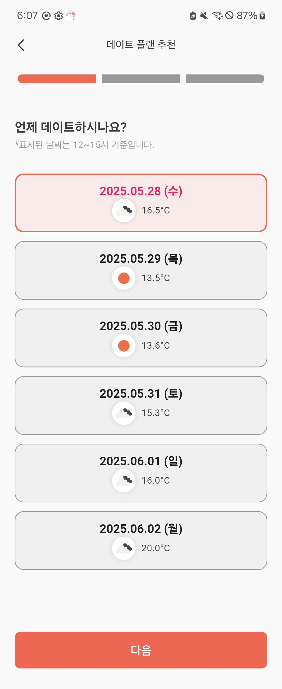
  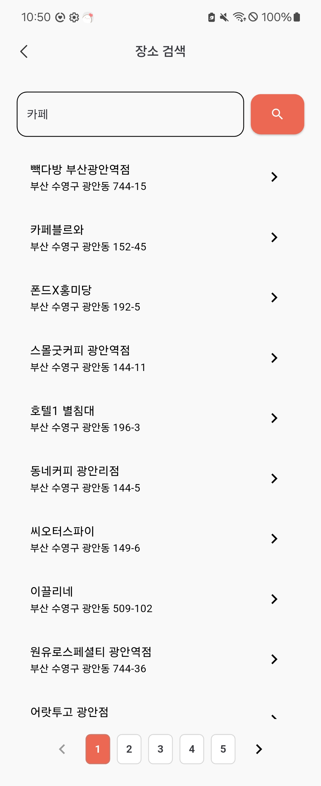
  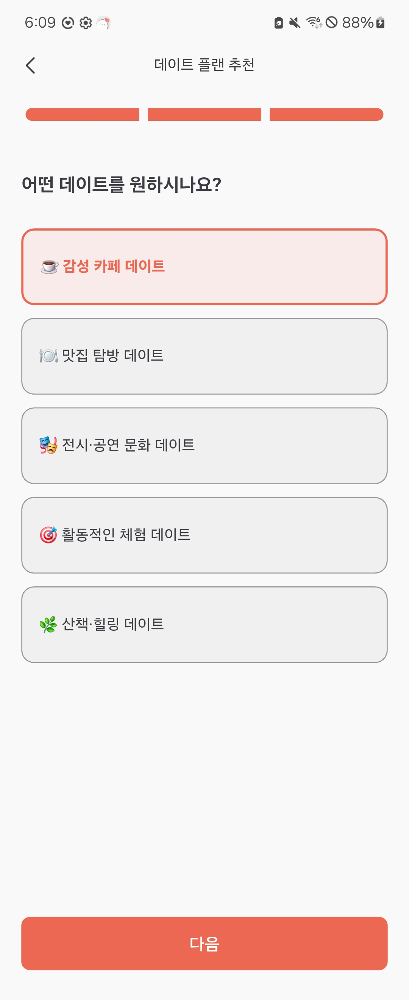
  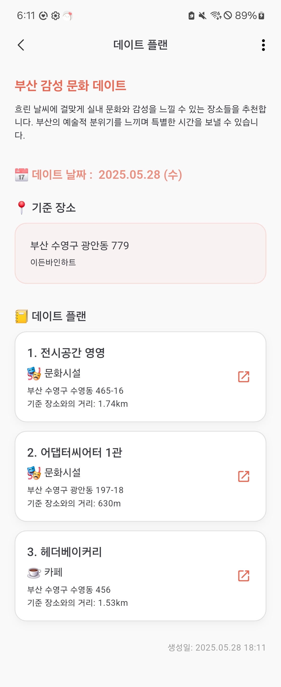
</p>

---

### 4. 데이트 기록 / 커뮤니티

<p align="center">
  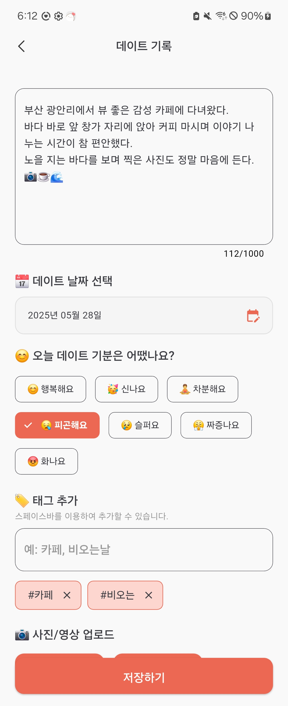
  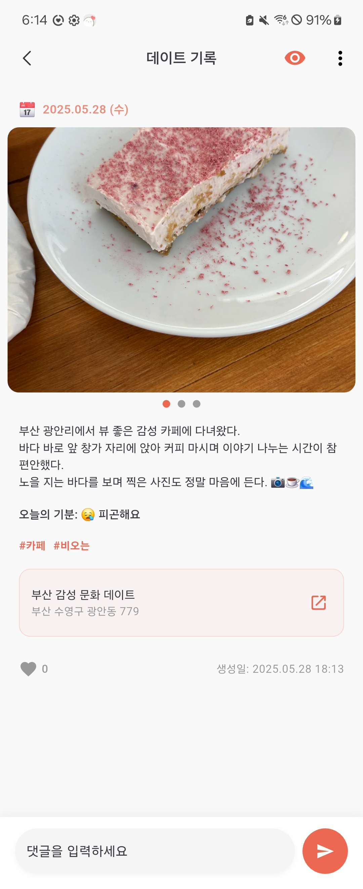
  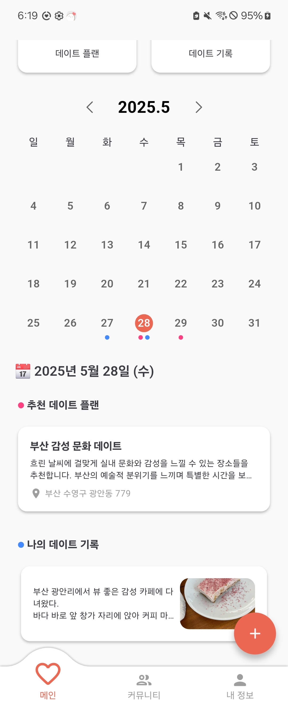
  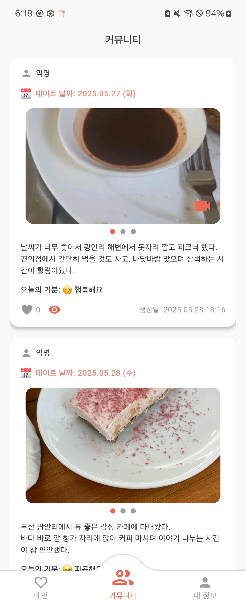
</p>

---

## 🛣️ 로드맵

| 버전 | 목표 시기* | 핵심 항목 | 상세 |
| --- | --- | --- | --- |
| **v1.0.0 (현재)** | 2025‑05 (완료) | 초기 릴리스 | - openAI API 기반 데이트 플랜 추천
- geolocator, kakao local API 를 활용한 주소 관리 및 플레이스 추가 
- 구글 로그인 및 firebase 연동
- 데이트 기록 / 사진, 영상 관련 기능
- 회원가입 및 닉네임/프로필 설정
- 커뮤니티 관련 기능 (공유, 좋아요) |
| v1.0.1 | 2025‑06 | 기능 확장 | 커뮤니티 댓글 기능 추가, 지도 관련 기능 추가(즐겨찾는 플레이스, 장소 검색 등) |
| v1.0.2 | 2025‑06 | 기능 개선 | 커뮤니티 기능 관련 FCM & Cloud Functions 알림 |

---

## 🙋‍♂️ 개발자

- GitHub: [@ora16382](https://github.com/ora16382)
- Email: [ora16382@email.com](mailto:ora16382@email.com)